# Diagrama de flujo — MDCOCO02
> Generado por exCOB v1.1 — Origen: MDCOCOMM.cbl

```mermaid
flowchart TD
    A[[PROCESAR-TRANSFERENCIA]] --> B[RTNA-SALDOS-SYSTEMATIC]
    A --> C[GENERAR-HEADER-TR-TOLD]
    A --> D[GENERAR-VARIABLES-TOLD]
    A --> E[ENLAZAR-PROGRAMA-TLDOD87]
    A --> F[GENERAR-HEADER-TR-TOLD-EXT]

    B --> B1[RTNA-LEE-TARIFARIO]
    B1 -.-> B1a[(TFRFTARI)]
    B -.-> B2([SIMO201])
    B -.-> B3([SSTO101])

    C --> C1[LEE-MDCFCAS]
    C1 -.-> C1a[(MDCFCAS)]

    E -.-> E1([TLDOD87])
    E --> E2[800-REGISTRO-BITACORA]
    E --> E3[MSG-RETORNO-TOLD]

    E2 --> E2a[805-PREPARA-DATOS-COMUNES]
    E2 --> E2b{810-PREPARA-DATA-BITACORA}
    E2 --> E2c[820-EJECUTA-INSERT-BITACORA]
    E2b --> E2b1[840-PREPARA-DATA-TRANSFERENCIA]
    E2c -.-> E2c1[(MDC_CABO)]

    E3 -.-> E3a[(TLDFDDLG)]
    E3 --> E3b[VALIDAR-CONSULTA-CAS]

    PR{PREPARAR-RESPUESTA} --> PR1[GENERA-TRX-CAS]
    PR --> PR2[PROCESA-RETENCION-IM]
    PR --> PR3[LEE-UPDATE-MDCFCAS]
    PR --> PR4[REGRABA-MDCFCAS]

    PR1 --> PR1a[OBTIENE-SEMILLA]
    PR1a --> PR1a1[LEE-UPDATE-SEMILLA-PPA]
    PR1a1 -.-> PR1a1a[(MDCFPARA)]
    PR1a --> PR1a2[REGRABA-SEMILLA-PPA]
    PR1 -.-> PR1b([CASO100])
    PR1 -.-> PR1c([CASO101])
    PR1 --> PR1d[GRABA-TRANS-CAS]
    PR1d -.-> PR1d1[(MDCFCAS)]

    PR2 -.-> PR2a([SIMO111])

    INFRA[[INFRAESTRUCTURA]] --> I1[INICIAR]
    I1 --> I1a[RECIBIR-DATA]
    INFRA --> I2[TERMINAR]
    I2 --> I2a[ENVIAR-MENSAJE-RESP]
    I2 --> I2b[ENVIAR-MENSAJE-ERR]

    A -.-> TLDCDD87_CPY{{TLDCDD87}}
    B -.-> SIMCDAT2_CPY{{SIMCDAT2}}
    B -.-> SSTLACC_CPY{{SSTLACC}}
    C -.-> MDCFCAS_CPY{{MDCFCAS}}
    PR1 -.-> CASCCA1_CPY{{CASCCA1}}
    PR2 -.-> CASCCA2_CPY{{CASCCA2}}
    E2c -.-> DMDCLCAB_DCL{{DMDCLCAB}}

    style A fill:#08AAD2,color:#fff
    style INFRA fill:#08AAD2,color:#fff
    style PR fill:#FFE347,color:#333
    style E2b fill:#FFE347,color:#333
    style B2 fill:#67A353,color:#fff
    style B3 fill:#67A353,color:#fff
    style E1 fill:#67A353,color:#fff
    style PR1b fill:#67A353,color:#fff
    style PR1c fill:#67A353,color:#fff
    style PR2a fill:#67A353,color:#fff
    style B1a fill:#2EA597,color:#fff
    style C1a fill:#2EA597,color:#fff
    style E2c1 fill:#2EA597,color:#fff
    style E3a fill:#2EA597,color:#fff
    style PR1a1a fill:#2EA597,color:#fff
    style PR1d1 fill:#2EA597,color:#fff
    style TLDCDD87_CPY fill:#f2f3f3,color:#333
    style SIMCDAT2_CPY fill:#f2f3f3,color:#333
    style SSTLACC_CPY fill:#f2f3f3,color:#333
    style MDCFCAS_CPY fill:#f2f3f3,color:#333
    style CASCCA1_CPY fill:#f2f3f3,color:#333
    style CASCCA2_CPY fill:#f2f3f3,color:#333
    style DMDCLCAB_DCL fill:#f2f3f3,color:#333
```

## Leyenda
| Símbolo | Tipo |
|---------|------|
| `[[  ]]` | Párrafo principal |
| `[  ]` | Párrafo interno |
| `{  }` | Párrafo acoplado (lógica mezclada) |
| `([  ])` | Programa externo (CICS LINK) |
| `[(  )]` | Tabla DB2 o Dataset VSAM |
| `{{  }}` | Copybook |
| `-->` | PERFORM |
| `-.->` | Llamada externa |
